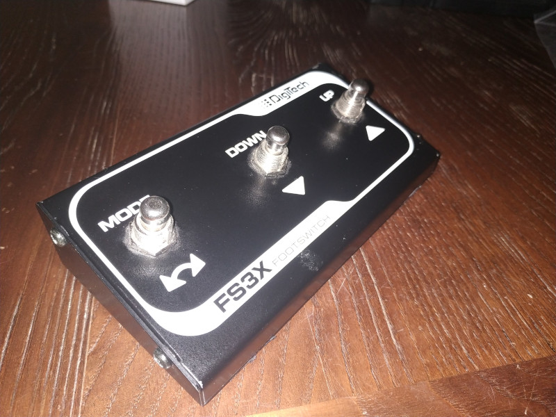
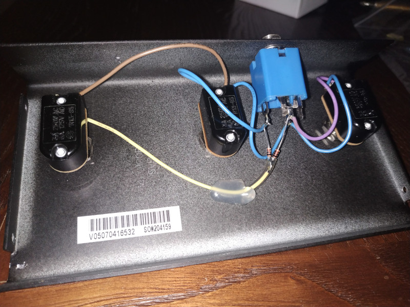
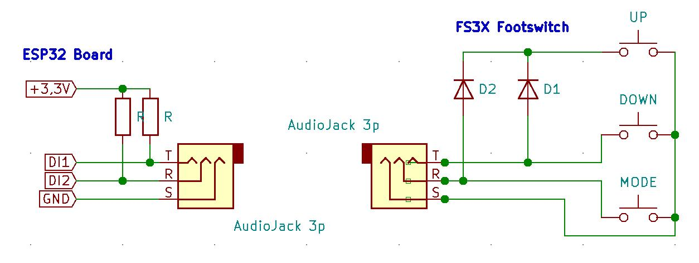
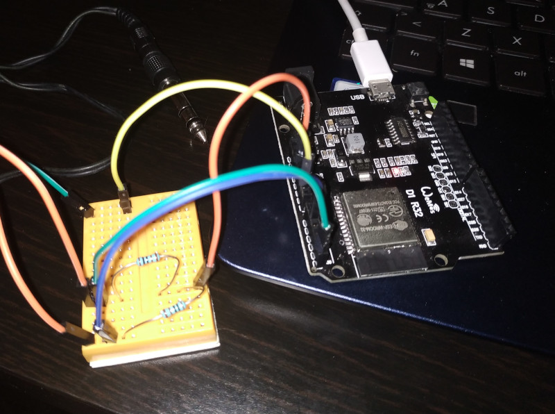

# BLE MIDI Foot Controller (waiting for a new name...)

A BLE (Bluetooth Low Energy) MIDI implementation based on ESP32

 
> Disclaimer: 
> this is a working-in-progress project at very early stage. I hope to implement new feature and a new hardware soon
 
 
## Description
 
This project aim to build a BLE MIDI Pedal Board using a cheap ESP32 
 
I created this project to control music and guitar applications, but you can use it for any BLE MIDI compatible application ;)

This project is born as personal project, but now it has become a project of Fablab Romagna APS, with the contribution of other FLR members.
You can found the original README file describing the old implementation [here](./README_OLD.md) .

Now the goal is to create a MIDI foot controller that will act as standard MIDI controller (MIDI BLE Server) or a device to connect to other MIDI device, as a smartphone or PC do (MIDI BLE client).

The switch between the 2 modes should be implemented without reprogramming the firmware, and the MIDI messages assigned to each footswitch should be configured via sw.

You can find implementation details on [docs](/docs) folder.

## The Hardware

In this first version I use a DigiTech FS3X footswitch connected to a Wemos D1 R32 ESP32 board

The FS3X has a 6,35mm Jack Stereo output.

I pulled up 2 DI of ESP32 and I use the tip and the ring of the Jack to pull low the ESP32 inputs

When the UP switch is pressed, both inputs are pulled down

## The Software

I program the ESP32 using Arduino IDE and libraries. See the code under the source directory

Tested on Android 6, iOS 11 and Linux Debian.

For debug purpose I suggest the following utilities to verify if your device can receive midi messages:

* midiscope for Android
* midiwrench for iOS
* JACK  + kmidimon  for Linux

## Credits
Copyright (C) 2021 Fablab Romagna (www.fablabromagna.org) 

All the project files, sources and documents are released as open source and free software
