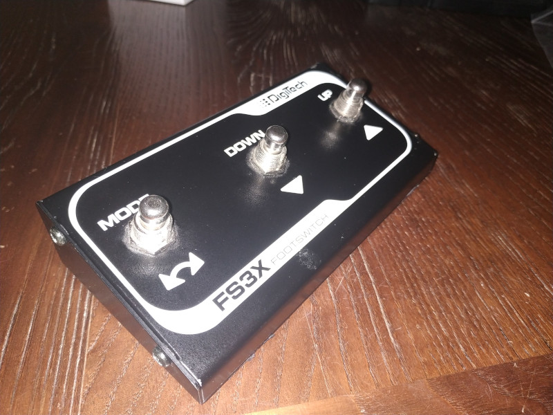
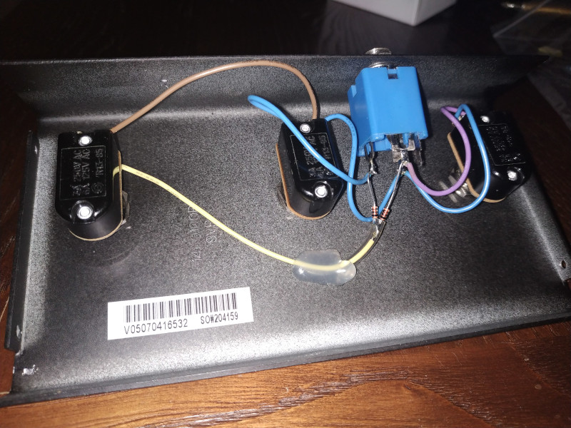
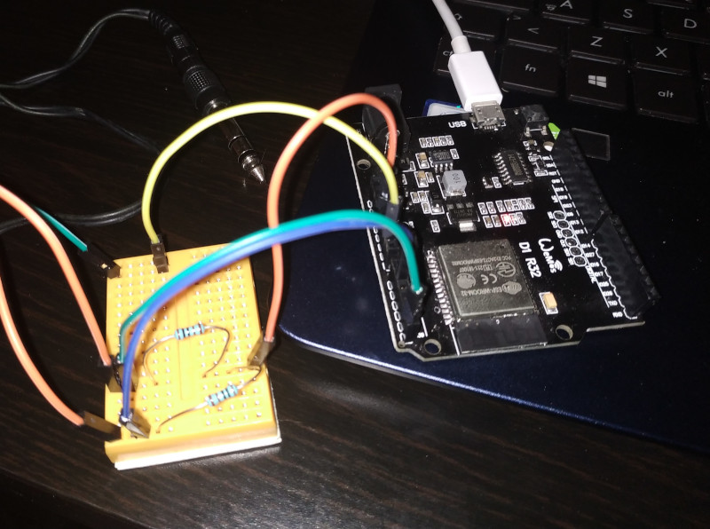

# ITLab BLE MIDI Board

A BLE (Bluetooth Low Energy) MIDI implementation based on ESP32

 
> Disclaimer: 
> this is a working-in-progress project at very early stage. I hope to implement new feature and a new hardware soon
 
## Description
 
This project aim to build a BLE MIDI Pedal Board using a cheap ESP32 
 
I created this project to control music and guitar applications, but you can use it for any BLE MIDI compatible application ;)

## The Hardware

In this first version I use a DigiTech FS3X footswitch connected to a Wemos D1 R32 ESP32 board

The FS3X has a 6,35mm Jack Stereo output.

I pulled up 2 DI of ESP32 and I use the tip and the ring of the Jack to pull low the ESP32 inputs

When the UP switch is pressed, both inputs are pulled down

## The Software

I program the ESP32 using Arduino IDE and libraries. See the code under the source directory

## Credits
Copyright (C) 2020 Ivan Tarozzi (itarozzi@gmail.com) 

[https://github.com/itarozzi/itlab_ble_midi_board]

All the project files, sources and documents are released as open source and free software
