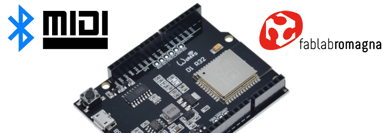

# BLE MIDI Foot Controller (waiting for a new name...)

A BLE (Bluetooth Low Energy) MIDI implementation based on ESP32

 
> Note: 
> this is a working-in-progress project at very early stage. I hope to implement new feature and a new hardware soon
 
 
## Description
 
This project aim to build a BLE MIDI Pedal Board using a cheap ESP32, or similar microcontroller.
 
We created this project to control music and guitar applications, but you can use it for any BLE MIDI compatible application.

>This project is born as personal project, but now it has become a project of Fablab Romagna APS, with the contribution of other FLR members.
>You can found the original README file describing the old implementation [here](./README_OLD.md) .

We are developing a complete new project to create a MIDI foot controller that will work in two modes:

**1.  standard MIDI controller (MIDI BLE Server)**   - use it as external controller for your PC/smartphone//tablet/compatible device

> you can use it, for example, to control a DAW or a GuitarFX or a looper running on PC/mobile

**2. client MIDI device (MIDI BLE Client)** - use it to connect to BLE controller, acting as PC or smartphone/tablet

> you can use it, for example, to control a device like NUX Mighty, intead to use the original smartphone application

The MIDI controller will consists of a series of monentary-on switches. The number of switches should be configured in the firmware.

Changing between the two modes should be implemented without reprogramming the firmware

MIDI messages assigned to each footswitch should be configured via software, without reprogramming the firmware.

As optional feature the MIDI controller could work also with standard DIN MIDI port or USB (this requires more HW or different microcontroller)

The controller should work in both rechargeable battery and line powered mode (5V).

You can find implementation details on [docs](/docs) folder:

* [The hardware](/hardware/)
* [The software](/software/)

## Credits
Copyright (C) 2021 Fablab Romagna (www.fablabromagna.org) 

All the project files, sources and documents are released as open source and free software
